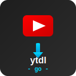
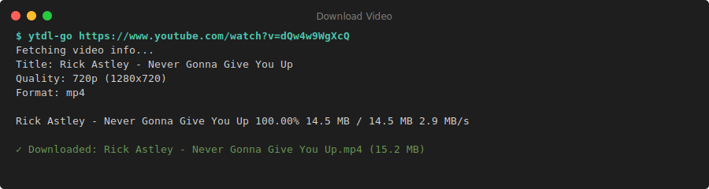
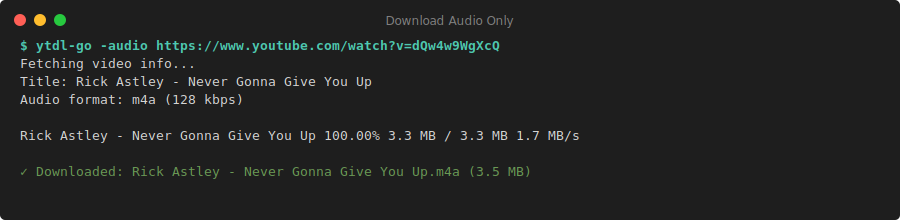
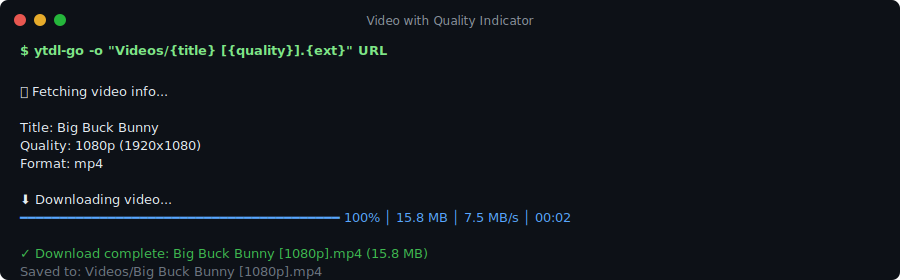
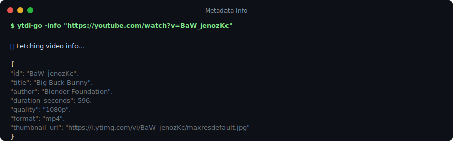
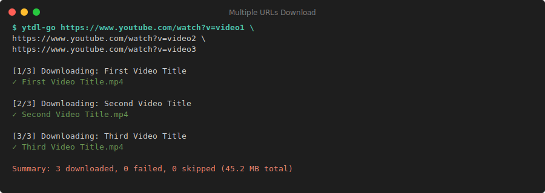

# ytdl-go 📺



## A powerful yt-dlp-style downloader written in Go

[](https://golang.org/)
[](https://github.com/lvcoi/ytdl-go/LICENSE)
[](https://github.com/lvcoi/ytdl-go/releases)
[](https://pkg.go.dev/github.com/lvcoi/ytdl-go)

⚡ Blazing fast YouTube downloader with automatic retry, progress tracking, and YouTube Music support ⚡

---

## 📑 Table of Contents

- [✨ Features](#-features)
- [🚀 Installation](#-installation)
- [📖 Quick Start](#-quick-start)
- [💡 Usage Examples](#-usage-examples)
- [📊 Command Line Options](#-command-line-options)
- [🏷️ Output Templates](#️-output-templates)
- [🔧 Troubleshooting](#-troubleshooting)
- [🙏 Acknowledgments](#-acknowledgments)
- [📜 License](#-license)

---

## ✨ Features

| Core Capabilities | Advanced Tools |
| :--- | :--- |
| **🚀 High Performance**<br>Parallel downloads, automatic retries, and resume capability | **🎮 Interactive TUI**<br>Visual format selector to browse and pick quality streams |
| **📺 Broad Support**<br>Videos, Audio, Playlists, and YouTube Music URLs | **🏷️ Rich Metadata**<br>ID3 tags, JSON metadata, and sidecar files |
| **🎨 Format Control**<br>Select by quality (`1080p`, `best`), container (`mp4`), or itag | **⚙️ Automation Ready**<br>JSON output, custom templates, and quiet modes |

---

## 🚀 Installation

### Quick Install (Recommended)

```bash
go install github.com/lvcoi/ytdl-go@latest
```

*Requires Go 1.23+. Ensure `$GOPATH/bin` is in your `$PATH`.*

### Build from Source

```bash
git clone https://github.com/lvcoi/ytdl-go.git
cd ytdl-go
go build -o ytdl-go .
```

---

## 📖 Quick Start

### Basic Downloads

Download a video with best quality:
```bash
ytdl-go "https://youtube.com/watch?v=BaW_jenozKc"
```



Download audio only:
```bash
ytdl-go -audio "https://youtube.com/watch?v=BaW_jenozKc"
```



### Interactive Format Selection

Browse available formats and select interactively:
```bash
ytdl-go -list-formats "https://youtube.com/watch?v=BaW_jenozKc"
```

**Controls:** `↑/↓` navigate • `Enter` download • `1-9` filter by itag • `q` quit

### Playlist Downloads

Download entire playlists:
```bash
ytdl-go "https://youtube.com/playlist?list=PL59FEE129ADFF2B12"
```


---

## 💡 Usage Examples

### Music Library Organization

**By Artist & Album:**
```bash
ytdl-go -audio -o "Music/{artist}/{album}/{title}.{ext}" URL
```


**Playlist with Track Numbers:**
```bash
ytdl-go -audio -o "Music/{playlist-title}/{index:02d} - {title}.{ext}" URL
```


### Video Collection

**With Quality Labels:**
```bash
ytdl-go -o "Videos/{title} [{quality}].{ext}" URL
```



### Advanced Usage

**Get Metadata Only:**
```bash
ytdl-go -info URL
```



**Specific Quality & Format:**
```bash
ytdl-go -quality 720p -format mp4 URL
```

**Parallel Downloads:**
```bash
ytdl-go -jobs 4 URL1 URL2 URL3 URL4
```



**Quiet Mode (for scripts):**
```bash
ytdl-go -quiet -audio URL
```


---

## 📊 Command Line Options

| Flag | Default | Description |
| :--- | :--- | :--- |
| `-o` | `{title}.{ext}` | Output template (see [Output Templates](#️-output-templates)) |
| `-audio` | `false` | Download best audio-only format |
| `-info` | `false` | Print video metadata as JSON without downloading |
| `-list-formats` | `false` | Launch interactive format selector |
| `-quality` | `best` | Target quality (`1080p`, `720p`, `128k`, `best`, `worst`) |
| `-format` | `` | Preferred container (`mp4`, `webm`, `m4a`) |
| `-itag` | `0` | Download specific format by itag number |
| `-meta` | `` | Override metadata (`key=value`, repeatable) |
| `-jobs` | `1` | Number of concurrent downloads |
| `-json` | `false` | Output as JSON (suppresses progress) |
| `-quiet` | `false` | Suppress progress output |
| `-timeout` | `3m` | Per-request timeout (e.g., `30s`, `5m`, `1h`) |
| `-log-level` | `info` | Log level: `debug`, `info`, `warn`, `error` |
| `-progress-layout` | `` | Custom progress template |
| `-segment-concurrency` | `auto` | Parallel segment downloads for HLS/DASH |
| `-playlist-concurrency` | `auto` | Parallel playlist entry downloads |

---

## 🏷️ Output Templates

Use the `-o` flag with placeholders to customize output paths:

| Placeholder | Description | Example |
| :--- | :--- | :--- |
| `{title}` | Video title (sanitized) | `My Video Title` |
| `{artist}` | Video author/artist | `Artist Name` |
| `{album}` | Album name (YouTube Music) | `Album Name` |
| `{id}` | Video ID | `dQw4w9WgXcQ` |
| `{ext}` | File extension | `mp4`, `webm`, `m4a` |
| `{quality}` | Quality label or bitrate | `1080p`, `128k` |
| `{playlist-title}` | Playlist name | `My Playlist` |
| `{playlist-id}` | Playlist ID | `PL59FEE129ADFF2B12` |
| `{index}` | Video index in playlist | `1`, `2`, `3` |
| `{count}` | Total videos in playlist | `25` |

**Template Examples:**
```bash
# Organize by artist and album
ytdl-go -audio -o "Music/{artist}/{album}/{title}.{ext}" URL

# Playlist with index
ytdl-go -o "{playlist-title}/{index:02d} - {title}.{ext}" URL

# Quality in filename
ytdl-go -o "Videos/{title} [{quality}].{ext}" URL
```

---

## 🔧 Troubleshooting

<details>
<summary><b>Common Issues & Fixes</b></summary>

- **403 Forbidden Errors:** The tool automatically retries with different methods. If persistent, check your IP reputation or try `-timeout 10m`.
- **Restricted Content:** Private, age-gated, or member-only videos require authentication which is currently **not supported**.
- **Playlists:** Empty videos or deleted entries in playlists are automatically skipped.

</details>

## 🙏 Acknowledgments

### 🛠️ Tech Stack & Dependencies

This project wouldn't be possible without the amazing open-source community:

- **[Go](https://golang.org/)** - The powerful programming language that makes ytdl-go fast and efficient
- **[github.com/kkdai/youtube/v2](https://github.com/kkdai/youtube)** - The core YouTube API library that handles all the heavy lifting
- **[YouTube](https://youtube.com)** - The platform we all love (and sometimes need to download from)

### 🌟 Special Thanks

- The Go community for creating such an amazing ecosystem
- The maintainers of `kkdai/youtube` for their excellent library
- All the contributors and users who help improve this project
- The yt-dlp project for inspiration and setting the standard for YouTube downloaders

### 🤝 Contributing

We welcome contributions! Please feel free to submit a Pull Request. For major changes, please open an issue first to discuss what you would like to change.

### 📬 Contact

Have questions or feedback? Feel free to open an issue on GitHub.

---

## Made with ❤️ by the ytdl-go team (aka ...me)

---

## 📜 License

This project is licensed under the MIT License - see the [LICENSE](LICENSE) file for details.
