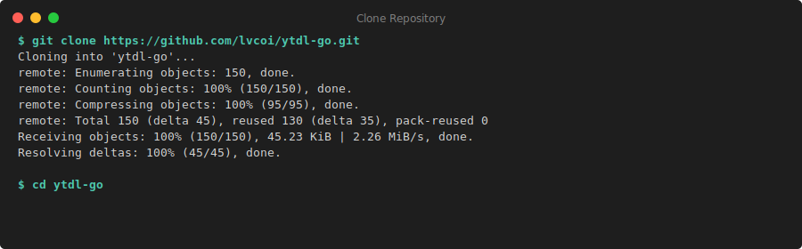
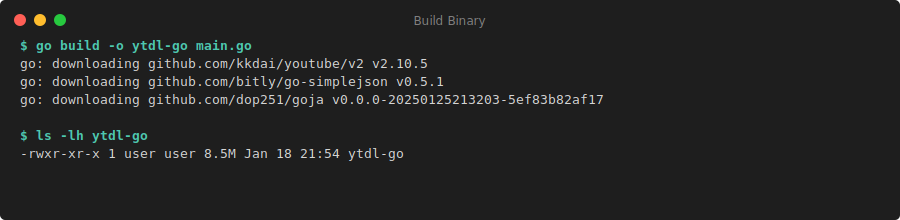
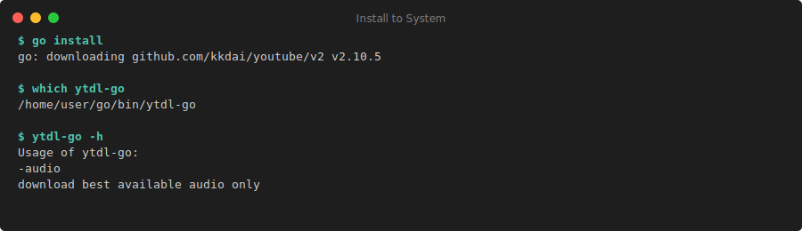
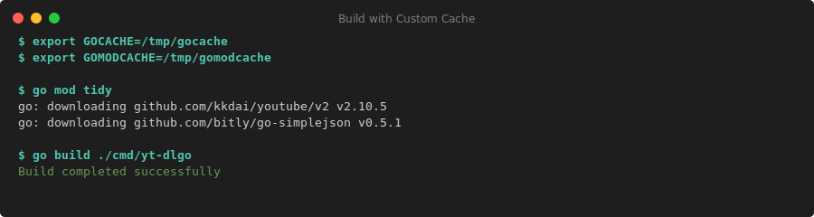
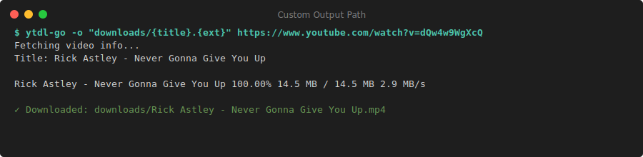
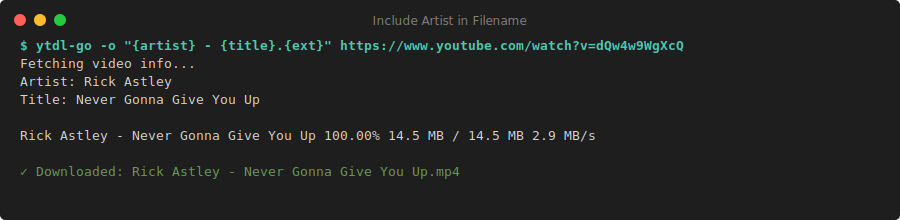
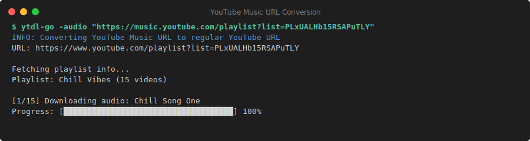
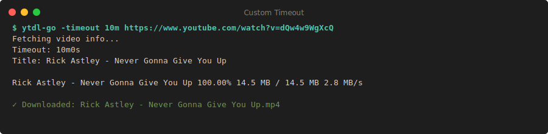

# ytdl-go 📺


## A powerful yt-dlp-style downloader written in Go

[](https://golang.org/)
[](https://github.com/lvcoi/ytdl-go/LICENSE)
[](https://github.com/lvcoi/ytdl-go/releases)
[](https://pkg.go.dev/github.com/lvcoi/ytdl-go)

⚡ Blazing fast YouTube downloader with automatic retry, progress tracking, and YouTube Music support ⚡

---

## Table of Contents

- [✨ Features](#-features)
- [🚀 Installation](#-installation)
- [📖 Usage](#-usage)
  - [🎯 Basic usage](#-basic-usage)
  - [🎨 Output customization](#-output-customization)
  - [📚 Playlist downloads](#-playlist-downloads)
  - [⚙️ Advanced options](#️-advanced-options)
- [📊 Command Line Options](#-command-line-options)
- [🏷️ Output Template Placeholders](#️-output-template-placeholders)
- [🎮 Interactive Features](#-interactive-features)
- [🛡️ Error Handling](#️-error-handling)
- [💡 Examples by Use Case](#-examples-by-use-case)
- [📝 Notes / Limitations](#-notes--limitations)
- [🔧 Troubleshooting](#-troubleshooting)
- [⚡ Performance](#-performance)
- [🙏 Acknowledgments](#-acknowledgments)
- [📜 License](#-license)

---

## ✨ Features

- **Metadata extraction** - `--info` prints detailed metadata (formats included) as pretty JSON
- **Format listing** - `--list-formats` prints available formats without downloading
- **Audio-only downloads** - `--audio` grabs the best audio-only format; otherwise downloads best progressive
- **Playlist support** - Playlist URLs are expanded and downloaded entry by entry with progress tracking
- **YouTube Music compatibility** - Automatically converts `music.youtube.com` URLs to regular YouTube URLs
- **Flexible output templating** - `-o` supports multiple placeholders:
  - `{title}` - Video title (sanitized)
  - `{artist}` - Video author/artist (sanitized)
  - `{album}` - Album name from YouTube Music metadata (when available)
  - `{id}` - Video ID
  - `{ext}` - File extension
  - `{quality}` - Quality label or bitrate
  - `{playlist_title}` - Playlist title (for playlists)
  - `{playlist_id}` - Playlist ID (for playlists)
  - `{index}` - Current index in playlist
  - `{count}` - Total number of videos in playlist
- **Progress tracking** - Real-time progress bar with speed indicators, or `--quiet` to suppress
- **Error resilience** - Automatic retry on 403 errors with fallback download method
- **Interactive file handling** - Prompts for overwrite/skip/rename when files exist (when TTY is available)
- **Configurable timeout** - Per-request timeout via `--timeout`
- **Comprehensive summaries** - Detailed download summary with success/failure/skip counts and total size

## 🚀 Installation

### 📋 Prerequisites

-  Go 1.23+

### ⚡ Quick Install (Recommended)

```bash
# Install directly from GitHub
go install github.com/lvcoi/ytdl-go/cmd/ytdl-go@latest
```

This will download, build, and install `ytdl-go` to your `$GOPATH/bin` directory (usually `~/go/bin`). Make sure this directory is in your `PATH`.

### 🔧 Build from source

```bash
# Clone the repository
git clone https://github.com/lvcoi/ytdl-go.git
cd ytdl-go
```



```bash
# Build the binary
go build -o ytdl-go ./cmd/ytdl-go
```



```bash
# Optional: Install to system path
go install ./cmd/ytdl-go
```



### 🏗️ Build with custom cache locations

If your environment blocks writes to the default Go caches, point them at a writable directory:

```bash
export GOCACHE=/tmp/gocache
export GOMODCACHE=/tmp/gomodcache
go mod tidy   # downloads dependencies
go build ./cmd/ytdl-go
```



## 📖 Usage

### 🎯 Basic usage

```bash
# Download video with best quality
ytdl-go https://www.youtube.com/watch?v=BaW_jenozKc
```


```bash
# Download audio-only
ytdl-go --audio https://www.youtube.com/watch?v=BaW_jenozKc
```


```bash
# Get video metadata without downloading
ytdl-go --info https://www.youtube.com/watch?v=BaW_jenozKc
```


```bash
# List available formats without downloading
ytdl-go --list-formats https://www.youtube.com/watch?v=BaW_jenozKc
```

### 🎨 Output customization

```bash
# Custom output path
ytdl-go -o "downloads/{title}.{ext}" https://www.youtube.com/watch?v=BaW_jenozKc
```



```bash
# Include artist in filename
ytdl-go -o "{artist} - {title}.{ext}" https://www.youtube.com/watch?v=BaW_jenozKc
```



```bash
# Download with quality indicator
ytdl-go -o "{title} [{quality}].{ext}" https://www.youtube.com/watch?v=BaW_jenozKc
```


### 📚 Playlist downloads

```bash
# Download entire playlist
ytdl-go "https://www.youtube.com/playlist?list=PL59FEE129ADFF2B12"
```


```bash
# Download playlist with custom structure
ytdl-go -o "downloads/{playlist_title}/{index:02d} - {title}.{ext}" "https://www.youtube.com/playlist?list=PL59FEE129ADFF2B12"
```


```bash
# Download playlist as audio-only with artist folders
ytdl-go --audio -o "music/{artist}/{playlist_title}/{index:02d} - {title}.{ext}" "https://www.youtube.com/playlist?list=PL59FEE129ADFF2B12"
```


```bash
# YouTube Music playlists (automatically converted)
ytdl-go --audio -o "music/{artist}/{title}.{ext}" "https://music.youtube.com/playlist?list=PLxUALHb15RSAPuTLY-05OageBIuHAOwJm"
```



### ⚙️ Advanced options

```bash
# Quiet mode (no progress output)
ytdl-go --quiet https://www.youtube.com/watch?v=BaW_jenozKc
```


```bash
# Custom timeout
ytdl-go --timeout 10m https://www.youtube.com/watch?v=BaW_jenozKc
```



```bash
# Multiple URLs
ytdl-go https://www.youtube.com/watch?v=video1 https://www.youtube.com/watch?v=video2
```


## 📊 Command Line Options

| Option | Default | Description |
| -------- | --------- | ------------- |
| `-o` | `{title}.{ext}` | Output path or template with supported placeholders |
| `-audio` | `false` | Download best available audio-only format |
| `-info` | `false` | Print video metadata as JSON without downloading |
| `-list-formats` | `false` | List available formats without downloading |
| `-quiet` | `false` | Suppress progress output (errors still shown) |
| `-timeout` | `3m` | Per-request timeout (e.g., 30s, 5m, 1h) |

## 🏷️ Output Template Placeholders

| Placeholder | Description | Example |
| ------------- | ------------- | --------- |
| `{title}` | Video title (sanitized for filesystem) | `My Video Title` |
| `{artist}` | Video author/artist (sanitized) | `Artist Name` |
| `{album}` | Album name from YouTube Music metadata (when available) | `Album Name` |
| `{id}` | YouTube video ID | `dQw4w9WgXcQ` |
| `{ext}` | File extension from format | `mp4`, `webm`, `m4a` |
| `{quality}` | Quality label or bitrate | `1080p`, `128k` |
| `{playlist_title}` | Playlist name | `My Awesome Playlist` |
| `{playlist_id}` | Playlist ID | `PL59FEE129ADFF2B12` |
| `{index}` | Current video index in playlist | `1`, `2`, `3` |
| `{count}` | Total videos in playlist | `25` |

## 🎮 Interactive Features

When downloading to an existing file and running in a terminal:

- **[o]verwrite** - Replace the existing file
- **[s]kip** - Skip downloading this file
- **[r]ename** - Automatically rename to `filename (1).ext`
- **[q]uit** - Abort the entire download process

If stdin is not a TTY (e.g., when piping), existing files will be overwritten automatically with a warning.

## 🛡️ Error Handling

The downloader includes robust error handling:

- **403 Forbidden errors** - Automatically retries with a different download method
- **Network timeouts** - Respects the configured timeout per request
- **Playlist errors** - Continues downloading remaining videos if one fails
- **Detailed reporting** - Each error is reported with context about which video failed

## 💡 Examples by Use Case

### 🎵 Music archiving

```bash
# Download playlist as organized music library by artist/album/song
ytdl-go --audio -o "Music/{artist}/{album}/{title}.{ext}" "https://music.youtube.com/playlist?list=..."

# Download with track numbers
ytdl-go --audio -o "Music/{artist}/{album}/{index:02d} - {title}.{ext}" "https://music.youtube.com/playlist?list=..."

# Download playlist songs under playlist folder
ytdl-go --audio -o "Music/{playlist_title}/{title}.{ext}" "https://www.youtube.com/playlist?list=..."

# Download with playlist and track number
ytdl-go --audio -o "Music/{playlist_title}/{index:02d} - {title}.{ext}" "https://www.youtube.com/playlist?list=..."
```

### 🎬 Video collection

```bash
# Download with quality and date
ytdl-go -o "Videos/{playlist_title}/{title} [{quality}].{ext}" "https://www.youtube.com/playlist?list=..."
```

### 📄 Metadata extraction

```bash
# Export playlist metadata to JSON
ytdl-go --info "https://www.youtube.com/playlist?list=..." > playlist.json
```

### 📦 Bulk downloads

```bash
# Download multiple playlists
for url in $(cat playlist_urls.txt); do
    ytdl-go --audio -o "music/{artist}/{title}.{ext}" "$url"
done
```

## 📝 Notes / Limitations

- Only progressive formats are pulled for video; DASH-only video+audio muxing is not implemented
- YouTube Music URLs (`music.youtube.com`) are converted to regular YouTube URLs automatically
- Authentication, cookies, proxies, and subtitle downloads are not yet supported
- Output directories are created as needed; trailing slash on `-o` forces treating it as a directory
- Maximum 9999 automatic renames when using the rename option to prevent infinite loops

## 🔧 Troubleshooting

### 403 Forbidden errors

The downloader automatically handles most 403 errors by retrying with a different method. If you continue to see issues:

1. Check your network connection
2. Try increasing the timeout: `--timeout 10m`
3. The video might be region-restricted or private

### Playlist download issues

- YouTube Music playlists are automatically converted
- Some private or unlisted playlists may require authentication (not yet supported)
- Empty playlist entries are automatically skipped

### File naming

- Invalid filesystem characters are replaced with hyphens
- Very long titles may be truncated
- Use the `{artist}` placeholder for better organization of music content

## ⚡ Performance

The downloader is optimized for:

- Concurrent metadata fetching for playlists
- Minimal memory usage with streaming downloads
- Fast resumption on network errors
- Efficient progress tracking without impacting download speed

## 🙏 Acknowledgments

### 🛠️ Tech Stack & Dependencies

This project wouldn't be possible without the amazing open-source community:

- **[Go](https://golang.org/)** - The powerful programming language that makes ytdl-go fast and efficient
- **[github.com/kkdai/youtube/v2](https://github.com/kkdai/youtube)** - The core YouTube API library that handles all the heavy lifting
- **[YouTube](https://youtube.com)** - The platform we all love (and sometimes need to download from)

### 🌟 Special Thanks

- The Go community for creating such an amazing ecosystem
- The maintainers of `kkdai/youtube` for their excellent library
- All the contributors and users who help improve this project
- The yt-dlp project for inspiration and setting the standard for YouTube downloaders

### 🤝 Contributing

We welcome contributions! Please feel free to submit a Pull Request. For major changes, please open an issue first to discuss what you would like to change.

### 📬 Contact

Have questions or feedback? Feel free to open an issue on GitHub.

---

## Made with ❤️ by the ytdl-go team (aka ...me)

---

## 📜 License

This project is licensed under the MIT License - see the [LICENSE](LICENSE) file for details.
