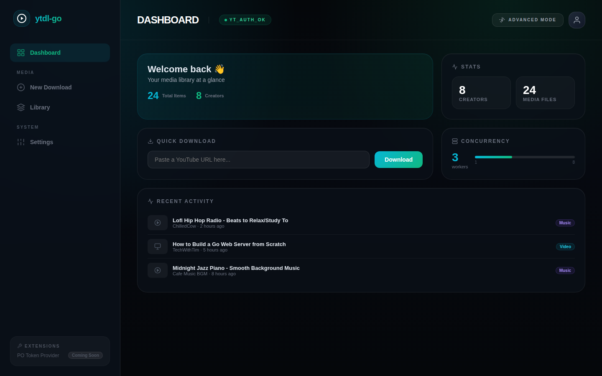
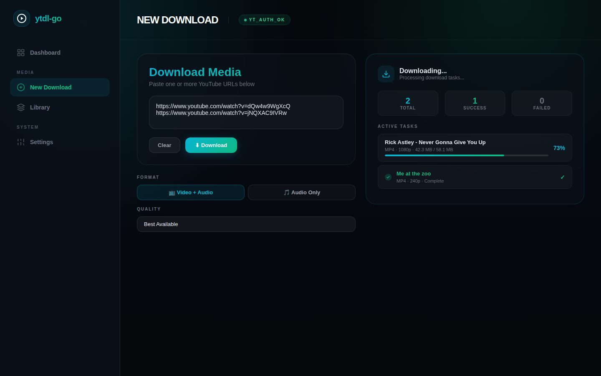
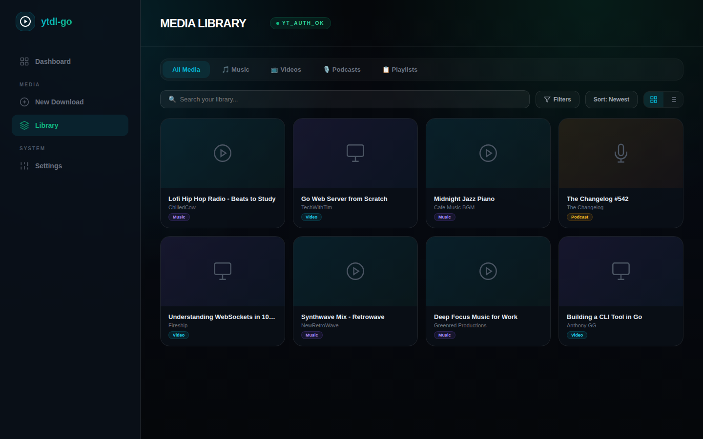
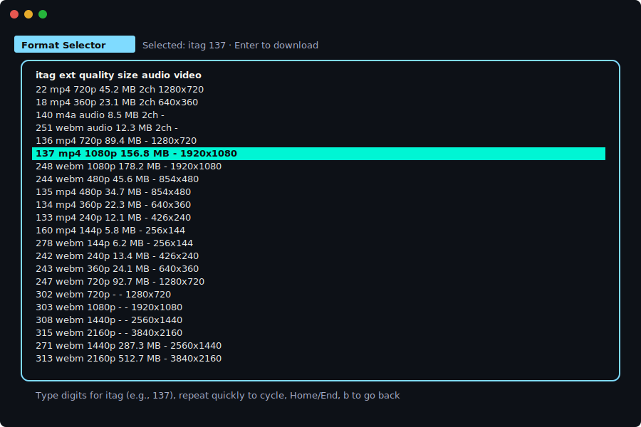

<div align="center">


# ytdl-go

**A powerful, blazing-fast YouTube downloader written in Go — now with a full Web UI.**

[](https://github.com/lvcoi/ytdl-go/releases)
[](https://golang.org/)
[](https://github.com/lvcoi/ytdl-go/LICENSE)
[](https://lvcoi.github.io/ytdl-go/)

</div>

---

## TL;DR

**ytdl-go** downloads YouTube videos, audio, and playlists — fast. Use it from the **command line** or launch the brand-new **Web UI** (`ytdl-go -web`). Parallel downloads, automatic retries, resume support, ID3 tagging, and an interactive TUI format selector are all built in.

> **v0.2.0 Beta is out!** This release introduces the Web UI, a customizable dashboard, a media library with built-in player, and real-time download progress — all served from a single binary. The CLI works exactly as before.
>
> 📖 **Full documentation lives on the [wiki](https://lvcoi.github.io/ytdl-go/)** — installation guides, CLI reference, architecture docs, and more.

---

## ✨ Features

| Feature | Description |
| --- | --- |
| 🚀 **Parallel Downloads** | Multiple concurrent downloads with retry & resume |
| 🌐 **Web UI** | Dashboard, download queue, media library & player |
| 🎮 **Interactive TUI** | Browse and pick formats visually with `-list-formats` |
| 🎵 **Audio & Video** | Videos, audio-only, playlists, YouTube Music |
| 🏷️ **Metadata** | Automatic ID3 tags, JSON sidecars, custom templates |
| ⚙️ **Automation** | JSON output, quiet mode, custom output paths |

---

## 🚀 Quick Start

```bash
# Install (requires Go 1.24+)
go install github.com/lvcoi/ytdl-go@latest

# Download a video
ytdl-go "https://youtube.com/watch?v=..."

# Download audio only
ytdl-go -audio "https://youtube.com/watch?v=..."

# Launch the Web UI
ytdl-go -web
```

<details>
<summary><b>Build from source (with Web UI)</b></summary>

```bash
git clone https://github.com/lvcoi/ytdl-go.git && cd ytdl-go

# Build everything and launch the UI
./build.sh --web
```

</details>

---

## 🌐 Web UI

The v0.2.0 Web UI is a SolidJS single-page app served directly by the Go backend — no separate process needed.

Launch it with:

```bash
ytdl-go -web
```

**What you get:**

- **Dashboard** — Customizable widget grid with drag-and-drop layout, recent activity, quick download, and system stats.
- **Download View** — Paste one or more URLs, pick format & quality, and watch real-time progress over a WebSocket connection.
- **Media Library** — Browse all downloaded media with thumbnail gallery, search, filters (Music / Videos / Podcasts), and sortable columns.
- **Built-in Player** — Floating audio/video player with queue support and minimized mode.
- **Settings** — Configure concurrency, storage paths, and upcoming auth options.

### Screenshots

> **Note:** Screenshots below show the UI with sample data. Your instance will look similar after downloading content.

| Dashboard | Download | Library |
| :---: | :---: | :---: |
|  |  |  |

*Glassmorphic dark UI with cyan/emerald accents — sidebar navigation, drag-and-drop dashboard widgets, real-time download progress, and a thumbnail gallery with built-in player.*

### Interactive CLI (TUI)

The command-line interface includes a visual format selector:

```bash
ytdl-go -list-formats "https://youtube.com/watch?v=..."
```



---

## 🛠️ Tech Stack

| Layer | Technology |
| --- | --- |
| **Backend** | [Go](https://golang.org/) 1.24 |
| **Frontend** | [SolidJS](https://www.solidjs.com/) + [Tailwind CSS](https://tailwindcss.com/) v4 |
| **TUI** | [Bubble Tea](https://github.com/charmbracelet/bubbletea) + [Lip Gloss](https://github.com/charmbracelet/lipgloss) |
| **Database** | [SQLite](https://www.sqlite.org/) via [modernc.org/sqlite](https://pkg.go.dev/modernc.org/sqlite) (pure Go) |
| **Real-time** | WebSocket ([gorilla/websocket](https://github.com/gorilla/websocket)) |
| **Media** | [FFmpeg](https://ffmpeg.org/) (muxing & metadata), [ID3v2](https://github.com/bogem/id3v2) (audio tags) |
| **Icons** | [Lucide](https://lucide.dev/) |
| **Docs** | [Zensical](https://zensical.org/) (Material Design docs) |
| **Build** | [Vite](https://vitejs.dev/) (frontend), `go build` (backend) |

---

## 📖 Documentation

Everything beyond this README is on the **[documentation site](https://lvcoi.github.io/ytdl-go/)**:

| Section | What's There |
| --- | --- |
| **[User Guide](https://lvcoi.github.io/ytdl-go/user-guide/installation/)** | Installation, quick start, format selection, playlists, output templates, troubleshooting |
| **[Developer Guide](https://lvcoi.github.io/ytdl-go/developer-guide/architecture/)** | Architecture, API reference, contributing, best practices |
| **[CLI Reference](https://lvcoi.github.io/ytdl-go/reference/cli-options/)** | Full list of command-line flags |

---

## 🔧 Troubleshooting

<details>
<summary><b>Common issues</b></summary>

- **403 Forbidden** — Automatic retries handle most cases. Try `-timeout 10m` if persistent.
- **Restricted content** — Private / age-gated videos are not yet supported.
- **Port in use** — `ytdl-go -web` auto-falls back to the next available port.
- **Missing thumbnails** — Re-download to generate sidecar metadata used by the library.

</details>

---

## 🙏 Acknowledgments

ytdl-go stands on the shoulders of these projects:

- **[yt-dlp](https://github.com/yt-dlp/yt-dlp)** — The gold standard YouTube downloader. ytdl-go was heavily inspired by yt-dlp's feature set and approach.
- **[kkdai/youtube](https://github.com/kkdai/youtube)** — The original Go YouTube library that ytdl-go forked and extended as [ytdl-lib](https://github.com/lvcoi/ytdl-lib).
- **[Charm](https://charm.sh/)** — [Bubble Tea](https://github.com/charmbracelet/bubbletea), [Bubbles](https://github.com/charmbracelet/bubbles), and [Lip Gloss](https://github.com/charmbracelet/lipgloss) power the interactive terminal UI.
- **[SolidJS](https://www.solidjs.com/)** — The reactive framework behind the Web UI.
- **[Zensical](https://zensical.org/)** — Documentation site generator (Material Design).
- **[Gorilla WebSocket](https://github.com/gorilla/websocket)** — Real-time communication in the Web UI.

---

<div align="center">

Made with ❤️ by the ytdl-go team

[License](LICENSE) · [Report Issue](https://github.com/lvcoi/ytdl-go/issues) · [Documentation](https://lvcoi.github.io/ytdl-go/)

</div>
