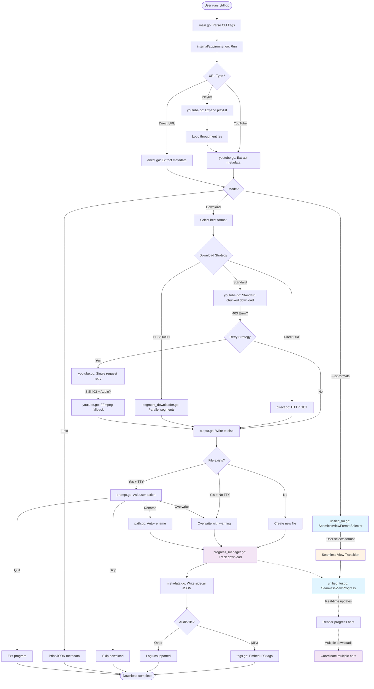

# Architecture Overview

This document provides a comprehensive overview of ytdl-go's internal architecture, explaining how data flows from user input to final disk output.

## Table of Contents

- [Visual Code Map](#visual-code-map)
- [The TUI Model](#the-tui-model)
- [Download Strategies](#download-strategies)
- [Concurrency Model](#concurrency-model)
- [Module Breakdown](#module-breakdown)
- [Design Principles](#design-principles)
- [Future Architecture Considerations](#future-architecture-considerations)

## Visual Code Map

The following diagram visualizes the complete data flow in ytdl-go, from command-line arguments to the final written file:



## The TUI Model

ytdl-go uses the [Bubble Tea](https://github.com/charmbracelet/bubbletea) framework for its terminal user interface (TUI). The implementation is centered around `unified_tui.go`, which provides a unified, seamless experience for format selection and download progress.

### Key Components

#### `SeamlessTUI` Struct

The main TUI coordinator that manages the entire interactive experience:
- Handles both format selection and progress tracking in a single program
- Manages view transitions without screen flicker
- Coordinates between user interaction and background downloads

#### View Types

The TUI has two primary views:

1. **`SeamlessViewFormatSelector`** - Interactive format browser
   - Displays available video/audio formats
   - Shows quality, codec, bitrate, and file size
   - Allows keyboard navigation (↑/↓, j/k, Page Up/Down, Home/End)
   - Quick jump by itag number (1-9 keys)

2. **`SeamlessViewProgress`** - Download progress display
   - Shows real-time progress bars for active downloads
   - Displays download speed, ETA, and completion percentage
   - Supports multiple concurrent downloads
   - Shows log messages above progress bars
   - Handles interactive prompts (overwrite/skip/rename)

### Seamless Transition Concept

One of the key features in ytdl-go's TUI is the **seamless transition** between views. The TUI uses the alternate screen buffer (via `tea.WithAltScreen()`) but transitions smoothly between format selection and progress views within a single Bubble Tea program session:

```go
// User selects a format in SeamlessViewFormatSelector
format := user_selected_format

// Transition happens within the SAME tea.Program session
model.view = SeamlessViewProgress

// Progress bars appear in the same TUI session
// No program restart or screen reinitialization
```

**Why this matters:**
- **Smooth user experience** - The user sees a continuous flow from selection to download within one TUI session
- **Context preservation** - The same program handles both views
- **Better UX** - Feels like a single, cohesive application rather than separate tools

**Implementation details:**
- Both views share the same `tea.Program` instance
- View changes are handled through model updates within the same session
- The `selectionChan` communicates format selection without quitting the TUI
- Progress updates continue seamlessly after format selection
- Uses alternate screen buffer for clean terminal handling

### Message Flow

The TUI uses Bubble Tea's message-passing architecture:

```
User Input → tea.Msg → Model.Update() → View Change → Model.View() → Terminal Output
```

Key message types:
- `seamlessRegisterMsg` - Register a new download task
- `seamlessUpdateMsg` - Update progress for a task
- `seamlessFinishMsg` - Mark a task as complete
- `seamlessLogMsg` - Display log messages
- `seamlessPromptMsg` - Show interactive prompts (file exists, etc.)

## Download Strategies

ytdl-go implements a multi-layered fallback strategy to handle various YouTube restrictions and network conditions. The strategy chain ensures maximum reliability:

### Strategy Chain

```
1. Standard Chunked Download (Default)
   ↓ (On 403 Forbidden)
2. Retry with Single Request
   ↓ (On 403 + Audio-only format)
3. FFmpeg Fallback (Extract from progressive video)
```

### 1. Standard Chunked Download

**What:** Default method using YouTube's chunked streaming API  
**Implementation:** `youtube.go` - standard `Client.GetStreamContext()`  
**Characteristics:**
- Downloads in small chunks (256KB - 2MB based on file size)
- Provides smooth progress updates
- Efficient memory usage
- Works for most video/audio formats

**When it fails:**
- YouTube sometimes returns 403 Forbidden for certain formats
- More common with audio-only formats
- Can be region or rate-limit dependent

### 2. Retry with Single Request

**What:** Attempts download without chunking  
**Implementation:** `youtube.go` - single-range HTTP request  
**Characteristics:**
- Downloads entire file in one request
- Less frequent server interactions
- May bypass some rate limiting

**When it fails:**
- YouTube may still block certain formats
- Audio-only formats are particularly problematic
- Persistent 403 errors

### 3. FFmpeg Fallback (Audio-Only)

**What:** Downloads a progressive video format and extracts audio  
**Implementation:** `youtube.go` - `downloadWithFFmpegFallback()`  
**Process:**
1. Downloads a progressive format (preferably itag 22 - 720p with 192kbps AAC)
2. Falls back to itag 18 (360p with 96kbps AAC) if 720p unavailable
3. Uses FFmpeg to extract audio track
4. Writes to final output path

**Characteristics:**
- Requires FFmpeg to be installed
- Downloads more data (video + audio instead of just audio)
- Higher quality audio source (AAC from progressive formats)
- Most reliable method (progressive formats rarely blocked)

**Trade-offs:**
- Slower (larger download size)
- Requires external dependency (FFmpeg)
- Higher bandwidth usage

### Decision Logic

The download strategy is selected automatically:

```go
// Attempt standard download
err := downloadStandard()
if isStatus403(err) {
    // Try retry strategy
    err = downloadWithRetry()
    if isStatus403(err) && isAudioFormat(format) && ffmpegAvailable() {
        // Use FFmpeg fallback
        return downloadWithFFmpegFallback()
    }
}
```

### Strategy Selection by Format Type

| Format Type | Strategy 1 | Strategy 2 | Strategy 3 |
|-------------|-----------|-----------|-----------|
| Progressive Video | Chunked | Single Request | N/A |
| Audio-Only | Chunked | Single Request | FFmpeg Fallback |
| DASH/HLS | Segment Download | N/A | N/A |
| Direct URL | HTTP GET | N/A | N/A |

## Concurrency Model

ytdl-go implements sophisticated concurrency management to maximize download performance while maintaining clean progress output and system stability.

### ProgressManager

The `ProgressManager` (in `progress_manager.go`) is the central coordinator for all concurrent download operations. It solves the challenging problem of displaying multiple progress bars across goroutines without race conditions or output corruption.

#### Key Responsibilities

1. **Goroutine Coordination**
   - Manages multiple download goroutines
   - Ensures thread-safe progress updates
   - Prevents race conditions on shared state

2. **Progress Bar Management**
   - Tracks multiple concurrent downloads
   - Renders progress bars in consistent order
   - Updates display in real-time

3. **Message Routing**
   - Routes progress updates from download goroutines to TUI
   - Handles log messages from multiple sources
   - Manages interactive prompts without blocking downloads

#### Architecture

```
Download Goroutine 1 ──┐
                       ├──→ ProgressManager ──→ Bubble Tea Program ──→ Terminal
Download Goroutine 2 ──┤     (Coordinator)         (Renderer)
                       │
Download Goroutine N ──┘
```

**Thread Safety:**
- All progress updates go through channels / Bubble Tea message passing (no shared mutable state exposed to callers)
- `tea.Program.Send()` is thread-safe and goroutine-friendly
- Each download goroutine gets a unique ID
- `ProgressManager` uses a mutex and atomic counters internally to coordinate shared state safely

#### Lifecycle

```go
// 1. Create manager
pm := NewProgressManager(opts)

// 2. Start rendering goroutine
pm.Start(ctx)

// 3. Register download tasks
pm.Register("task-1", "Downloading video.mp4", totalSize)

// 4. Send progress updates (from any goroutine)
pm.Update("task-1", currentBytes, totalBytes)

// 5. Mark completion
pm.Finish("task-1")

// 6. Stop manager (waits for clean shutdown)
pm.Stop()
```

### Concurrency Levels

ytdl-go supports multiple levels of concurrency:

#### 1. Job-Level Concurrency (`-jobs N`)
- Downloads multiple URLs simultaneously
- Each URL gets its own download goroutine
- Progress bars shown for each active download
- Controlled by `-jobs` flag

#### 2. Playlist-Level Concurrency (`-playlist-concurrency N`)

> Note: As of the current implementation, playlist downloads are processed sequentially.
> The `-playlist-concurrency` flag is parsed but ignored; playlist-level concurrency is
> a planned feature and not yet implemented.
#### 3. Segment-Level Concurrency (`-segment-concurrency N`)
- For HLS/DASH streams, downloads segments in parallel
- Default: auto (based on CPU count)
- Implemented in `segment_downloader.go`
- Each segment gets its own progress tracking

### Concurrency Safety Features

#### Progress Update Batching

To avoid overwhelming the terminal with updates:
- Updates are batched and rendered at consistent intervals
- Prevents flickering from too-frequent redraws
- Maintains smooth, readable progress display

#### Graceful Cancellation

- Respects context cancellation from Ctrl+C
- Cleans up partial downloads
- Closes all goroutines gracefully
- No orphaned background processes

#### Error Isolation

- Error in one download doesn't affect others
- Each download reports its own status
- Failed downloads are marked clearly
- Summary shows success/failure counts

## Module Breakdown

### Core Modules

| Module | File(s) | Purpose |
|--------|---------|---------|
| **Main Entry** | `main.go` | CLI flag parsing, main function entry point |
| **Runner** | `internal/app/runner.go` | Orchestrates download workflow, manages concurrency |
| **Downloader** | `internal/downloader/downloader.go` | Core download logic, strategy selection |
| **YouTube** | `internal/downloader/youtube.go` | YouTube-specific extraction and downloading |
| **Direct Download** | `internal/downloader/direct.go` | Direct URL downloads (MP4, WebM, HLS, DASH) |
| **Segments** | `internal/downloader/segment_downloader.go` | HLS/DASH segment downloading and concatenation |
| **TUI** | `internal/downloader/unified_tui.go` | Terminal UI for format selection and progress |
| **Progress** | `internal/downloader/progress_manager.go` | Coordinates progress bars across goroutines |
| **Output** | `internal/downloader/output.go` | File writing, path resolution, template expansion |
| **Metadata** | `internal/downloader/metadata.go` | Sidecar JSON generation, metadata extraction |
| **Tags** | `internal/downloader/tags.go` | ID3 tag embedding for audio files |
| **Prompts** | `internal/downloader/prompt.go` | Interactive file conflict resolution |
| **Paths** | `internal/downloader/path.go` | Path sanitization, auto-rename logic |
| **HTTP** | `internal/downloader/http.go` | HTTP client configuration, timeout handling |
| **Errors** | `internal/downloader/errors.go` | Error categorization, exit codes |
| **Music** | `internal/downloader/music.go` | YouTube Music URL conversion |
| **Web Server** | `internal/web/*` | Web UI server (optional) |

### Data Flow by Module

```
main.go
  └─→ internal/app/runner.go (Run)
      ├─→ internal/downloader/youtube.go (ExtractMetadata)
      │   └─→ internal/downloader/metadata.go (ProcessMetadata)
      │
      ├─→ internal/downloader/unified_tui.go (Format Selection)
      │   └─→ internal/downloader/prompt.go (User Prompts)
      │
      ├─→ internal/downloader/downloader.go (Download)
      │   ├─→ internal/downloader/youtube.go (YouTube downloads)
      │   ├─→ internal/downloader/direct.go (Direct downloads)
      │   └─→ internal/downloader/segment_downloader.go (HLS/DASH)
      │
      ├─→ internal/downloader/progress_manager.go (Progress Tracking)
      │   └─→ internal/downloader/unified_tui.go (Progress Display)
      │
      └─→ internal/downloader/output.go (Write Files)
          ├─→ internal/downloader/path.go (Path Resolution)
          ├─→ internal/downloader/metadata.go (Write Sidecar)
          └─→ internal/downloader/tags.go (Embed Tags)
```

### Key Interfaces and Types

#### Printer Struct

Coordinates logging and output (defined in `printer.go` as a concrete struct):
```go
type Printer struct {
    quiet    bool
    color    bool
    renderer ProgressRenderer
    // ...
}
```

#### ProgressWriter Type

Coordinates progress tracking using atomics (defined in `progress.go`):
```go
type progressWriter struct {
    size       atomic.Int64
    total      atomic.Int64
    start      atomic.Int64
    lastUpdate atomic.Int64
    finished   atomic.Bool
    prefix     string
    printer    *Printer
    taskID     string
    renderer   ProgressRenderer
}
```

## Design Principles

### 1. Progressive Enhancement

- Basic functionality works without TUI
- `-quiet` flag for non-interactive use
- `-json` for machine-readable output
- TUI adds polish but isn't required

### 2. Fail-Safe Defaults

- Sensible defaults for all options
- Auto-detection of capabilities (FFmpeg, terminal type)
- Graceful degradation when features unavailable

### 3. User-Centric Error Handling

- Clear, actionable error messages
- Categorized exit codes for scripting
- Automatic retry on transient failures
- Interactive prompts when appropriate

### 4. Performance by Design

- Concurrent downloads where possible
- Streaming downloads (no full buffering)
- Efficient progress updates
- Minimal memory footprint

### 5. Maintainability

- Clear module boundaries
- Single responsibility per file
- Comprehensive error categorization
- Consistent naming conventions

## Future Architecture Considerations

### Potential Enhancements

- Plugin system for additional extractors
- Resume support for YouTube downloads
- Browser cookie extraction for authenticated content
- Subtitle download and embedding
- Multi-audio track handling
- DASH video+audio muxing

### Non-Goals (By Design)

- DRM circumvention
- Browser automation
- Content re-encoding
- Platform-specific hacks

## Related Documentation

- [Backend Structure](backend-structure) - Deep dive into Go modules and concurrency
- [Frontend Structure](frontend-structure) - Web UI architecture
- [API Reference](../../api-reference) - REST API and SSE events
