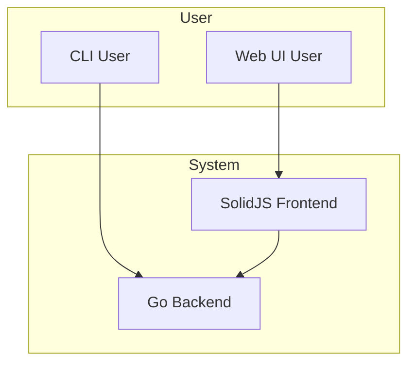

# ytdl-go: System Architecture

This document provides a high-level overview of the `ytdl-go` system architecture. The system is composed of two main parts: a Go backend and a SolidJS frontend.

## Backend

The backend is a Go application that provides a CLI and a web API for downloading videos from YouTube and other websites. It is responsible for:

*   Parsing command-line arguments.
*   Handling the download process, including metadata extraction, format selection, and an interactive TUI.
*   Managing concurrent downloads.
*   Serving a web API for the frontend.

For a more detailed overview of the backend architecture, see the [Backend Architecture](./internal/docs/BACKEND_ARCHITECTURE.md) document.

## Frontend

The frontend is a single-page application (SPA) built with SolidJS. It provides a user-friendly web interface for interacting with the `ytdl-go` application. It is responsible for:

*   Providing a user interface for downloading videos.
*   Displaying a library of downloaded media.
*   Providing a media player.
*   Communicating with the backend via a REST API.

For a more detailed overview of the frontend architecture, see the [Frontend Architecture](./frontend/docs/FRONTEND_ARCHITECTURE.md) document.

## High-Level Data Flow

