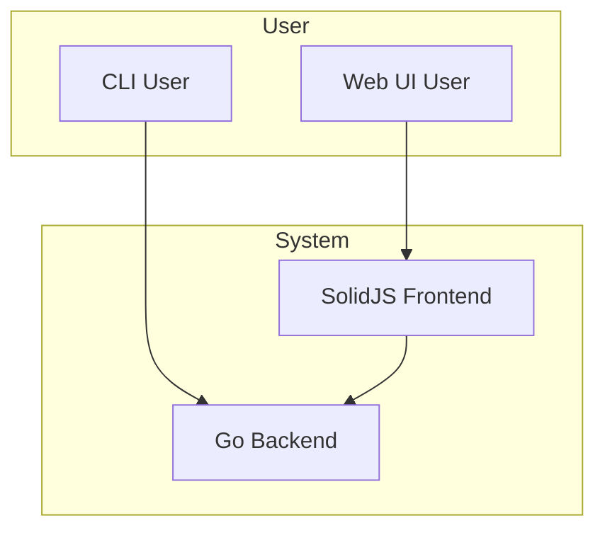

# Architecture Overview

The system is composed of two main parts: a Go backend and a SolidJS frontend.

## Backend

The backend is a Go application that provides a CLI and a web API for downloading videos. It handles:

- Command-line argument parsing
- Download process management (metadata extraction, format selection, interactive TUI)
- Concurrent download coordination
- Web API for the frontend

See [Backend Structure](backend-architecture.md) for details.

## Frontend

The frontend is a single-page application (SPA) built with SolidJS. It provides a web interface for:

- Downloading videos
- Browsing a library of downloaded media
- Media playback
- Communicating with the backend via REST API

See [Frontend Structure](frontend-architecture.md) for details.

## High-Level Data Flow



## Module Breakdown

| Module | File(s) | Purpose |
| --- | --- | --- |
| **Main Entry** | `main.go` | CLI flag parsing, entry point |
| **Runner** | `internal/app/runner.go` | Orchestrates download workflow, manages concurrency |
| **Downloader** | `internal/downloader/downloader.go` | Core download logic, strategy selection |
| **YouTube** | `internal/downloader/youtube.go` | YouTube-specific extraction and downloading |
| **Direct Download** | `internal/downloader/direct.go` | Direct URL downloads |
| **Segments** | `internal/downloader/segment_downloader.go` | HLS/DASH segment downloading |
| **TUI** | `internal/downloader/unified_tui.go` | Terminal UI for format selection and progress |
| **Progress** | `internal/downloader/progress_manager.go` | Coordinates progress bars across goroutines |
| **Output** | `internal/downloader/output.go` | File writing, path resolution, template expansion |
| **Metadata** | `internal/downloader/metadata.go` | Sidecar JSON generation |
| **Tags** | `internal/downloader/tags.go` | ID3 tag embedding |
| **Prompts** | `internal/downloader/prompt.go` | Interactive file conflict resolution |
| **Paths** | `internal/downloader/path.go` | Path sanitization, auto-rename |
| **HTTP** | `internal/downloader/http.go` | HTTP client configuration |
| **Errors** | `internal/downloader/errors.go` | Error categorization, exit codes |
| **Music** | `internal/downloader/music.go` | YouTube Music URL conversion |
| **Web Server** | `internal/web/*` | Web UI server |

## Data Flow by Module

```
main.go
  └─→ internal/app/runner.go (Run)
      ├─→ internal/downloader/youtube.go (ExtractMetadata)
      │   └─→ internal/downloader/metadata.go (ProcessMetadata)
      ├─→ internal/downloader/unified_tui.go (Format Selection)
      │   └─→ internal/downloader/prompt.go (User Prompts)
      ├─→ internal/downloader/downloader.go (Download)
      │   ├─→ internal/downloader/youtube.go (YouTube downloads)
      │   ├─→ internal/downloader/direct.go (Direct downloads)
      │   └─→ internal/downloader/segment_downloader.go (HLS/DASH)
      ├─→ internal/downloader/progress_manager.go (Progress Tracking)
      │   └─→ internal/downloader/unified_tui.go (Progress Display)
      └─→ internal/downloader/output.go (Write Files)
          ├─→ internal/downloader/path.go (Path Resolution)
          ├─→ internal/downloader/metadata.go (Write Sidecar)
          └─→ internal/downloader/tags.go (Embed Tags)
```

## Design Principles

1. **Progressive Enhancement** — Basic functionality works without TUI; `-quiet` and `-json` flags for non-interactive use
2. **Fail-Safe Defaults** — Sensible defaults, auto-detection of capabilities, graceful degradation
3. **User-Centric Error Handling** — Clear messages, categorized exit codes, automatic retries
4. **Performance by Design** — Concurrent downloads, streaming (no full buffering), minimal memory footprint
5. **Maintainability** — Clear module boundaries, single responsibility per file
